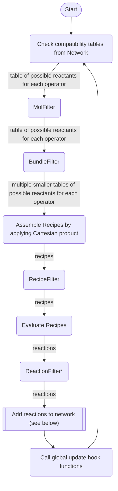
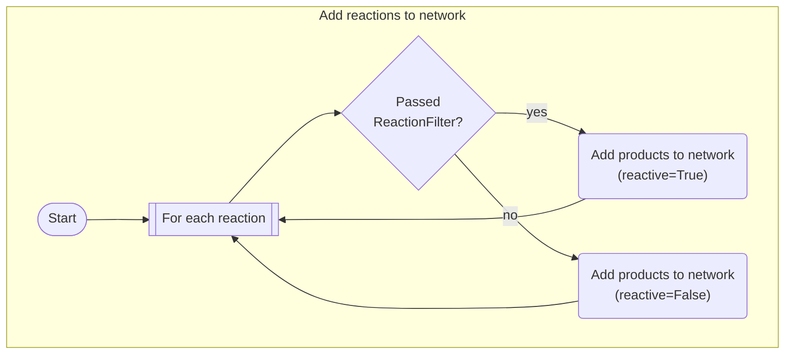

# Filters

In this tutorial, you will learn how to apply and compose filters in a network expansion context.

First, create an engine and network with some reactants and initial reagents, saving the network to a file in order to run multiple experiments from the same initial state.

```python
import doranet as dn

engine = dn.create_engine()

network = engine.new_network()

reagents = [
    "[H][H]",  # hydrogen
    "O",  # water
    "CO",  # methanol
    "CCO",  # ethanol
    "CC(O)=O",  # acetic acid
]

operator_smarts = {
    "ester_hydrolysis_nonring": "[O&+0:1]=[C&+0:2]-&!@[O&+0&H0:3].[O&+0&H2:4]>>[*:1]=[*:2]-[*:4].[*:3]",
    "ester_hydrolysis_ring": "[O&+0:1]=[C&+0:2]-&@[O&+0&H0:3].[O&+0&H2:4]>>([*:1]=[*:2]-[*:4].[*:3])",
    "esterification": "[O&+0:1]=[C&+0:2]-[O&+0&H1:3].[O&+0&H1:4]>>[*:1]=[*:2]-[*:4].[*:3]",
    "esterification_intra": "([O&+0:1]=[C&+0:2]-[O&+0&H1:3].[O&+0&H1:4])>>[*:1]=[*:2]-[*:4].[*:3]",
    "hydrogenation of carbonyl": "[C+0:1]=[O+0:2].[H][H]>>[*:1][*:2]",
}

for smiles in reagents:
    network.add_mol(engine.mol.rdkit(smiles))

for name, smarts in operator_smarts.items():
    network.add_op(engine.op.rdkit(smarts), meta={"name": name})

network.save_to_file("6-filters")
```

## Basic Network Expansion Grows Quickly

Next, let's run one iteration of the Cartesian strategy to see the resulting system.

```python
from pprint import pprint

network = engine.network_from_file("6-filters")

strat = engine.strat.cartesian(network)

strat.expand(num_iter=1)
```

```sh
>>> pprint(list(enumerate(network.mols)))
[(0, MolDatBasic('[H][H]')),
 (1, MolDatBasic('O')),
 (2, MolDatBasic('CO')),
 (3, MolDatBasic('CCO')),
 (4, MolDatBasic('CC(=O)O')),
 (5, MolDatBasic('CC(O)O')),
 (6, MolDatBasic('COC(C)=O')),
 (7, MolDatBasic('CCOC(C)=O')),
 (8, MolDatBasic('CC(=O)OC(C)=O'))]
>>> pprint([(rxn, network.ops.meta(rxn.operator,["name"])["name"]) for rxn in network.rxns])
[(Reaction(operator=4, reactants=(4, 0), products=(5,)),
  'hydrogenation of carbonyl'),
 (Reaction(operator=2, reactants=(4, 2), products=(6, 1)), 'esterification'),
 (Reaction(operator=2, reactants=(4, 3), products=(7, 1)), 'esterification'),
 (Reaction(operator=2, reactants=(4, 4), products=(8, 1)), 'esterification')]
```

So far, so good. The acetic acid is the only one with double bonded O, so it is present in all four reactions: one hydrogenation and three esterifications, one of which is a self-esterification to form acetic anhydride (this is not typically performed in a single step, but is a valid relation and of some interest in terms of atom economy).

Now let's try two iterations.

```python
network = engine.network_from_file("6-filters")

strat = engine.strat.cartesian(network)

strat.expand(num_iter=2)
```

```sh
>>> pprint(list(enumerate(network.mols)))
[(0, MolDatBasic('[H][H]')),
 (1, MolDatBasic('O')),
 (2, MolDatBasic('CO')),
 (3, MolDatBasic('CCO')),
 (4, MolDatBasic('CC(=O)O')),
 (5, MolDatBasic('CC(O)O')),
 (6, MolDatBasic('COC(C)=O')),
 (7, MolDatBasic('CCOC(C)=O')),
 (8, MolDatBasic('CC(=O)OC(C)=O')),
 (9, MolDatBasic('CC(=O)OC(C)O')),
 (10, MolDatBasic('COC(C)O')),
 (11, MolDatBasic('CCOC(C)O'))]
>>> pprint([(rxn, network.ops.meta(rxn.operator,["name"])["name"]) for rxn in network.rxns])
[(Reaction(operator=4, reactants=(4, 0), products=(5,)),
  'hydrogenation of carbonyl'),
 (Reaction(operator=2, reactants=(4, 2), products=(6, 1)), 'esterification'),
 (Reaction(operator=2, reactants=(4, 3), products=(7, 1)), 'esterification'),
 (Reaction(operator=2, reactants=(4, 4), products=(8, 1)), 'esterification'),
 (Reaction(operator=2, reactants=(4, 5), products=(9, 1)), 'esterification'),
 (Reaction(operator=4, reactants=(6, 0), products=(10,)),
  'hydrogenation of carbonyl'),
 (Reaction(operator=0, reactants=(6, 1), products=(4, 2)),
  'ester_hydrolysis_nonring'),
 (Reaction(operator=4, reactants=(7, 0), products=(11,)),
  'hydrogenation of carbonyl'),
 (Reaction(operator=0, reactants=(7, 1), products=(4, 3)),
  'ester_hydrolysis_nonring'),
 (Reaction(operator=4, reactants=(8, 0), products=(9,)),
  'hydrogenation of carbonyl'),
 (Reaction(operator=0, reactants=(8, 1), products=(4, 4)),
  'ester_hydrolysis_nonring')]
```

The reactions keep getting larger and more numerous. Listed below are the molecules after ten generations.

```python
network = engine.network_from_file("6-filters")

strat = engine.strat.cartesian(network)

strat.expand(num_iter=10)
```

```sh
>>> pprint(list(enumerate(network.mols)))
[(0, MolDatBasic('[H][H]')),
 (1, MolDatBasic('O')),
 (2, MolDatBasic('CO')),
 (3, MolDatBasic('CCO')),
 (4, MolDatBasic('CC(=O)O')),
 (5, MolDatBasic('CC(O)O')),
 (6, MolDatBasic('COC(C)=O')),
 (7, MolDatBasic('CCOC(C)=O')),
 (8, MolDatBasic('CC(=O)OC(C)=O')),
 (9, MolDatBasic('CC(=O)OC(C)O')),
 (10, MolDatBasic('COC(C)O')),
 (11, MolDatBasic('CCOC(C)O')),
 (12, MolDatBasic('CC(O)OC(C)O')),
 (13, MolDatBasic('CC(=O)OC(C)OC(C)=O')),
 (14, MolDatBasic('COC(C)OC(C)=O')),
 (15, MolDatBasic('CCOC(C)OC(C)=O')),
 (16, MolDatBasic('CC(=O)OC(C)OC(C)O')),
 (17, MolDatBasic('COC(C)OC(C)O')),
 (18, MolDatBasic('CCOC(C)OC(C)O')),
 (19, MolDatBasic('CC(O)OC(C)OC(C)O')),
 (20, MolDatBasic('CC(=O)OC(C)OC(C)OC(C)=O')),
 (21, MolDatBasic('COC(C)OC(C)OC(C)=O')),
 (22, MolDatBasic('CCOC(C)OC(C)OC(C)=O')),
 (23, MolDatBasic('CC(=O)OC(C)OC(C)OC(C)O')),
 (24, MolDatBasic('COC(C)OC(C)OC(C)O')),
 (25, MolDatBasic('CCOC(C)OC(C)OC(C)O')),
 (26, MolDatBasic('CC(O)OC(C)OC(C)OC(C)O')),
 (27, MolDatBasic('CC(=O)OC(C)OC(C)OC(C)OC(C)=O')),
 (28, MolDatBasic('COC(C)OC(C)OC(C)OC(C)=O')),
 (29, MolDatBasic('CCOC(C)OC(C)OC(C)OC(C)=O')),
 (30, MolDatBasic('CC(=O)OC(C)OC(C)OC(C)OC(C)O')),
 (31, MolDatBasic('COC(C)OC(C)OC(C)OC(C)O')),
 (32, MolDatBasic('CCOC(C)OC(C)OC(C)OC(C)O')),
 (33, MolDatBasic('CC(O)OC(C)OC(C)OC(C)OC(C)O')),
 (34, MolDatBasic('CC(=O)OC(C)OC(C)OC(C)OC(C)OC(C)=O')),
 (35, MolDatBasic('COC(C)OC(C)OC(C)OC(C)OC(C)=O')),
 (36, MolDatBasic('CCOC(C)OC(C)OC(C)OC(C)OC(C)=O')),
 (37, MolDatBasic('CC(=O)OC(C)OC(C)OC(C)OC(C)OC(C)O')),
 (38, MolDatBasic('COC(C)OC(C)OC(C)OC(C)OC(C)O')),
 (39, MolDatBasic('CCOC(C)OC(C)OC(C)OC(C)OC(C)O'))]
```

The increase in number of molecules is due to a sequence of progressive hydrogenations and esterifications creating a swathe of new molecules with ever-longer chain lengths.

While the increase in number of molecules is somewhat manageable in this system, when there are more molecules and more operators of a particular type, it can end up increasing faster than exponential (specifically, O[C^(m^n)] where C is a constant, m is the average arguments per operator, and n is the number of iterations) overwhelm any computer. This is called the _combinatorial explosion_.

Now we will go over some ways to mitigate this explosion using filters.

## Using Filters to Mitigate Network Growth

A `filter` is a function which is used to remove Recipes or Reactions from consideration. There are several different types which are interjected at various points during the expansion.

The types of filters currently available are listed below in order of where they occur in the expansion process:

- MolFilter - Filters out Recipes which list a particular molecule as a reactant (optional arguments are the operator used and the argument to the operator the molecule is being considered for).
- BundleFilter - Reduces the operator-molecule combinations which can be considered.
- RecipeFilter - Filters out specific combinations of an operator and some reactants.
- ReactionFilter - Determines whether the products of a reaction will be tagged as `reactive`.

The diagram below shows how the expansion is typically performed and where these filters occur in the process.





The earlier a molecule or potential recipe is removed from consideration, the faster the computer will expand the network.

\* ReactionFilter does not remove reactions from the network, like the other filters. Instead, it causes certain reactions to have their products flagged as "non-reactive" so they are not considered potential reactants, even before they reach the MolFilter. However, these molecules and the reaction which produced them still appear in the network.

### Molecule Filtering

Molecule filtering is one of the easiest to understand. When compatible molecules and operators are loaded from the network, a MolFilter will make sure that, given the present conditions in the network (index of molecule and operator, those objects, metadata, etc.), the molecule is permitted to act as an argument to that operator. A simple example is a molecule blacklist based on molecule index.

If, in the above network, we wanted to prevent ethanol from being reacted, we can create a filter based on molecule index via `engine.filter.mol.indices()` and see how we can prevent ethanol from reacting in the network.

```python
network = engine.network_from_file("6-filters")

strat = engine.strat.cartesian(network)

ethanol_i = network.mols.i('CCO')
mol_filter = engine.filter.mol.indices([ethanol_i])

strat.expand(num_iter=1, mol_filter=mol_filter)
```

```sh
>>> pprint(list(enumerate(network.mols)))
[(0, MolDatBasic('[H][H]')),
 (1, MolDatBasic('O')),
 (2, MolDatBasic('CO')),
 (3, MolDatBasic('CCO')),
 (4, MolDatBasic('CC(=O)O')),
 (5, MolDatBasic('CC(O)O')),
 (6, MolDatBasic('COC(C)=O')),
 (7, MolDatBasic('CC(=O)OC(C)=O'))]
>>> pprint([(rxn, network.ops.meta(rxn.operator,["name"])["name"]) for rxn in network.rxns])
[(Reaction(operator=4, reactants=(4, 0), products=(5,)),
  'hydrogenation of carbonyl'),
 (Reaction(operator=2, reactants=(4, 2), products=(6, 1)), 'esterification'),
 (Reaction(operator=2, reactants=(4, 4), products=(7, 1)), 'esterification')]
```

As you can see, the esterification involving ethanol did not occur, because we invoked the filter which prevented it.

### Bundle Filtering

Bundle filtering is a somewhat complex concept, not totally necessary to run a network expansion, but is an extremely efficient procedure if it can be implemented instead of recipe filtering. How it exactly works will be described in a later tutorial.

One of the more powerful capabilities of a bundle filter is to separate molecules into different "classes" and only permit reactions between those classes. For example, if you have a particularly complex molecule, and wanted to know what could be produced from it, you would not care about the products of acetic acid + ethanol. By using the coreactants bundle filter, this can easily be done by passing it the indices of your coreactants. Thus, all recipes which involve only coreactants are efficiently rejected by the program.

In the example below, the molecule we are interested in starting from is butyric acid, and all the other reactants are considered to be coreactants.

```python
network = engine.network_from_file("6-filters")

strat = engine.strat.cartesian(network)

butyric_acid_i = network.add_mol(engine.mol.rdkit("CCCC(=O)O"))

coreactants_filter = engine.filter.bundle.coreactants(tuple(range(butyric_acid_i)))

strat.expand(num_iter=1, bundle_filter=coreactants_filter)
```

```sh
>>> pprint(list(enumerate(network.mols)))
[(0, MolDatBasic('[H][H]')),
 (1, MolDatBasic('O')),
 (2, MolDatBasic('CO')),
 (3, MolDatBasic('CCO')),
 (4, MolDatBasic('CC(=O)O')),
 (5, MolDatBasic('CCCC(=O)O')),
 (6, MolDatBasic('CCCC(O)O')),
 (7, MolDatBasic('CCCC(=O)OC')),
 (8, MolDatBasic('CCCC(=O)OCC')),
 (9, MolDatBasic('CCCC(=O)OC(C)=O')),
 (10, MolDatBasic('CCCC(=O)OC(=O)CCC'))]
>>> pprint([(rxn, network.ops.meta(rxn.operator,["name"])["name"]) for rxn in network.rxns])
[(Reaction(operator=4, reactants=(5, 0), products=(6,)),
  'hydrogenation of carbonyl'),
 (Reaction(operator=2, reactants=(5, 2), products=(7, 1)), 'esterification'),
 (Reaction(operator=2, reactants=(5, 3), products=(8, 1)), 'esterification'),
 (Reaction(operator=2, reactants=(4, 5), products=(9, 1)), 'esterification'),
 (Reaction(operator=2, reactants=(5, 4), products=(9, 1)), 'esterification'),
 (Reaction(operator=2, reactants=(5, 5), products=(10, 1)), 'esterification')]
```

As you can see, the reactions which we would typically have seen between molecules 0-4 did not occur. However, reactions between butyric acid and molecules 0-4, as well as between butyric acid and itself, did occur.

### Recipe Filtering

The last kind of pre-reaction filter is the Recipe Filter, which is applied to every Recipe which is generated, compared to the previous two which prevent Recipes from even being generated in the first place. The only Recipe Filter which is currently implemented is the Recipe equivalent of the above coreactant filter, and it works in the same way.

```python
network = engine.network_from_file("6-filters")

strat = engine.strat.cartesian(network)

butyric_acid_i = network.add_mol(engine.mol.rdkit("CCCC(=O)O"))

coreactants_filter = engine.filter.recipe.coreactants(tuple(range(butyric_acid_i)))

strat.expand(num_iter=1, recipe_filter=coreactants_filter)
```

```sh
>>> pprint(list(enumerate(network.mols)))
[(0, MolDatBasic('[H][H]')),
 (1, MolDatBasic('O')),
 (2, MolDatBasic('CO')),
 (3, MolDatBasic('CCO')),
 (4, MolDatBasic('CC(=O)O')),
 (5, MolDatBasic('CCCC(=O)O')),
 (6, MolDatBasic('CCCC(O)O')),
 (7, MolDatBasic('CCCC(=O)OC')),
 (8, MolDatBasic('CCCC(=O)OCC')),
 (9, MolDatBasic('CCCC(=O)OC(C)=O')),
 (10, MolDatBasic('CCCC(=O)OC(=O)CCC'))]
>>> pprint([(rxn, network.ops.meta(rxn.operator,["name"])["name"]) for rxn in network.rxns])
[(Reaction(operator=4, reactants=(5, 0), products=(6,)),
  'hydrogenation of carbonyl'),
 (Reaction(operator=2, reactants=(5, 2), products=(7, 1)), 'esterification'),
 (Reaction(operator=2, reactants=(5, 3), products=(8, 1)), 'esterification'),
 (Reaction(operator=2, reactants=(4, 5), products=(9, 1)), 'esterification'),
 (Reaction(operator=2, reactants=(5, 4), products=(9, 1)), 'esterification'),
 (Reaction(operator=2, reactants=(5, 5), products=(10, 1)), 'esterification')]
```

### Reaction Filtering

Reaction filters are the most powerful of all filter types in terms of both speed and memory, but come with a number of warnings and caveats.

Reaction filters are capable of preventing new molecules from even entering the pool of consideration via the `reactive` flag functionality provided by the network, while still allowing those molecules to be stored in the network. They can also be paired with metadata calculators for maximum efficiency (see the [next section](./7-metadata.md)). This is by far the most effective and fast method of accelerating network expansion, but it affects some non-obvious components of the network:

- It will not prevent molecules which are already in the network and flagged as `reactive=True` from reacting. A particular network is not permitted to change the `reactive` flag from `True` to `False` at any time. Thus, when starting with a network which has molecules you do not want to react which are flagged `reactive=True`, a ReactionFilter will do nothing to change this. General recommendations are to use a blacklisting MolFilter to block the specific indices of those molecules from reacting or to create a new network in case of performance issues. This is an unfortunate limitation of the chemical network interface (which is intended to guarantee consistency for computational efficiency reasons), and is generally unavoidable.
  - In the future, a network type `subnetwork` will be implemented which allows a subset of a primary network to be interacted with. This will mitigate the potential performance issues of the workaround above, so that networks which exist on an external data source can be used for expansion without loading all molecules in the network.
- Once used, molecules flagged `reactive=False` will not be reacted when using different strategies, even though they are present in the network. If this is not to your liking, you can use the `add_mol()` function to set the `reactive` flag to `True`. Keep in mind that this operation is not reversible.

One example where a reaction filter is efficient is in preventing certain reactions which produce very large molecules. This helps to 1. stem polymerization and 2. reduce the number of functional groups per molecule. Another application may be to prevent reactions which have a very large enthalpy of reaction, or which have products which are unrealistic or low in yield.

We can see the effect of using a filter to stop reactions which create molecules with more than 5 carbons in the example below.

```python
network = engine.network_from_file("6-filters")

strat = engine.strat.cartesian(network)

max_atoms_filter = engine.filter.reaction.max_atoms(max_atoms=5, proton_number=6)

strat.expand(num_iter=10, reaction_plan=max_atoms_filter)
```

```sh
>>> pprint(list(enumerate(network.mols)))
[(0, MolDatBasic('[H][H]')),
 (1, MolDatBasic('O')),
 (2, MolDatBasic('CO')),
 (3, MolDatBasic('CCO')),
 (4, MolDatBasic('CC(=O)O')),
 (5, MolDatBasic('CC(O)O')),
 (6, MolDatBasic('COC(C)=O')),
 (7, MolDatBasic('CCOC(C)=O')),
 (8, MolDatBasic('CC(=O)OC(C)=O')),
 (9, MolDatBasic('CC(=O)OC(C)O')),
 (10, MolDatBasic('COC(C)O')),
 (11, MolDatBasic('CCOC(C)O')),
 (12, MolDatBasic('CC(O)OC(C)O')),
 (13, MolDatBasic('CC(=O)OC(C)OC(C)=O')),
 (14, MolDatBasic('COC(C)OC(C)=O')),
 (15, MolDatBasic('CCOC(C)OC(C)=O')),
 (16, MolDatBasic('CC(=O)OC(C)OC(C)O')),
 (17, MolDatBasic('COC(C)OC(C)O')),
 (18, MolDatBasic('COC(C)OC(C)OC(C)=O'))]
>>> pprint([(rxn, network.ops.meta(rxn.operator,["name"])["name"]) for rxn in network.rxns])
[(Reaction(operator=4, reactants=(4, 0), products=(5,)),
  'hydrogenation of carbonyl'),
 (Reaction(operator=2, reactants=(4, 2), products=(6, 1)), 'esterification'),
 (Reaction(operator=2, reactants=(4, 3), products=(7, 1)), 'esterification'),
 (Reaction(operator=2, reactants=(4, 4), products=(8, 1)), 'esterification'),
 (Reaction(operator=2, reactants=(4, 5), products=(9, 1)), 'esterification'),
 (Reaction(operator=4, reactants=(6, 0), products=(10,)),
  'hydrogenation of carbonyl'),
 (Reaction(operator=0, reactants=(6, 1), products=(4, 2)),
  'ester_hydrolysis_nonring'),
 (Reaction(operator=4, reactants=(7, 0), products=(11,)),
  'hydrogenation of carbonyl'),
 (Reaction(operator=0, reactants=(7, 1), products=(4, 3)),
  'ester_hydrolysis_nonring'),
 (Reaction(operator=4, reactants=(8, 0), products=(9,)),
  'hydrogenation of carbonyl'),
 (Reaction(operator=0, reactants=(8, 1), products=(4, 4)),
  'ester_hydrolysis_nonring'),
 (Reaction(operator=4, reactants=(9, 0), products=(12,)),
  'hydrogenation of carbonyl'),
 (Reaction(operator=0, reactants=(9, 1), products=(4, 5)),
  'ester_hydrolysis_nonring'),
 (Reaction(operator=2, reactants=(4, 9), products=(13, 1)), 'esterification'),
 (Reaction(operator=2, reactants=(4, 10), products=(14, 1)), 'esterification'),
 (Reaction(operator=2, reactants=(4, 11), products=(15, 1)), 'esterification'),
 (Reaction(operator=2, reactants=(4, 12), products=(16, 1)), 'esterification'),
 (Reaction(operator=4, reactants=(14, 0), products=(17,)),
  'hydrogenation of carbonyl'),
 (Reaction(operator=0, reactants=(14, 1), products=(4, 10)),
  'ester_hydrolysis_nonring'),
 (Reaction(operator=2, reactants=(4, 17), products=(18, 1)), 'esterification')]
```

Other than the reaction filter, this scenario is identical to [the one at the start of this tutorial](./6-filters.md#basic-network-expansion-grows-quickly). However, despite 10 generations occurring, there are only 19 molecules present. Some of these have more than 5 carbon atoms, but they are unreactive and will not be reacted further.

The unreactivity of some of the later molecules is evident by checking the `.reactivity` property of the network.

```sh
>>> network.reactivity[0]
True
>>> network.reactivity[18]
False
```

#### Developer Note

You may have noticed that the argument for entering a reaction filter into `.expand()` is in fact `reaction_plan`, not `reaction_filter` as would follow the pattern of the other filter types. This is because reaction filters are much more internally complex than the pre-reaction filters, and are actually part of [an extended metadata calculation framework](./7-metadata.md) which enables the most powerful features of DORAnet, including the parallel calculation, optimization, and caching of critical molecule properties.

## Filter Composition

One of the additional powerful features of DORAnet is that it uses extensive [composition](https://en.wikipedia.org/wiki/Object_composition).

When using the built-in filters, or even designing your own, you may wonder "but what if I want an exception to this molecule filter for this specific operator" or "if only I was able to use both of these bundle filters." Your immediate reaction may to go straight to the code and create your own filter type which implements all the required functions, etc. However, if the basic filters you want already exist, and the statement you would like to filter for can be expressed in terms of the basic logical operators AND, OR, XOR, and NOT, then you don't have to write any additional classes or function! Note: this advertisement does not apply to the bundle filter.

Simply use the syntax `filter12 = filter1 & filter2` to create a new `filter12` which for an argument `x` tests the assertion `filter1(x) and filter2(x)`. These compounds can also be nested using parentheses: `filter12or3 = (filter1 & filter2) | filter3` tests the same assertion as previous, but also passes those assertions which pass `filter3`. The list of logical operators and their corresponding Python operators is shown below.

| Logical Operator | Python Operator |
| ---------------- | --------------- |
| AND              | &               |
| OR               | \|              |
| XOR              | ^               |
| NOT              | -               |

These operations are also implemented using short-circuiting, so make sure to order your filters such that the solution can be computed as quickly as possible!

Since the bundle filter doesn't work quite like the others in terms of its return value, you can't use these logical operators with it. However, you can chain multiple bundle filters using `>>`.

🚧🚧Example of filter composition coming soon.🚧🚧

## Takeaways

1. There are four varieties of filter: molecule filters, bundle filters, recipe filters, and reaction filters.
   1. Molecule filters test specific molecules and remove them from the reaction lists.
   1. Bundle filters limit the types of combinations which can occur to produce recipes.
   1. Recipe filters stop individual reactions from occurring. They are fairly inefficient, but some applications require them.
   1. Reaction filters do not stop reactions which have already occurred. Instead, they prevent the products of some reactions from being further reacted via the `reactive=False` flag.
1. Molecule, Recipe, and Reaction filters can be composed with logical operators `&`, `|`, `^`, and `-`. Bundle filters can be composed using `>>`.

Congratulations! You have finished the sixth part of the DORAnet tutorial. Proceed to the [next part](./7-metadata.md) to learn how to use the metadata engine to make your networks run even more efficiently!
