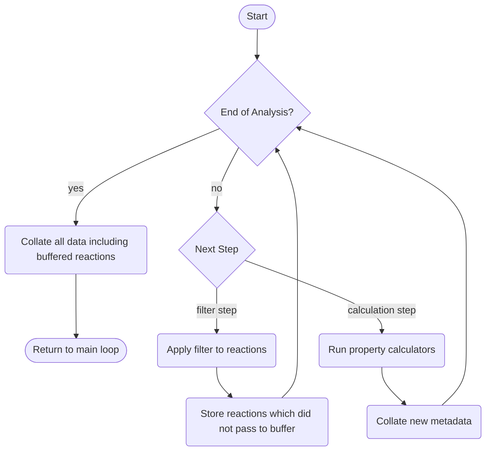

# Metadata

In this tutorial, you will learn how to generate metadata during network expansion.

First, create an engine and network with some reactants and initial reagents, saving the network to a file in order to run multiple experiments from the same initial state.

```python
import doranet as dn

engine = dn.create_engine()

network = engine.new_network()

reagents = [
    "[H][H]",  # hydrogen
    "O",  # water
    "CO",  # methanol
    "CCO",  # ethanol
    "CC(O)=O",  # acetic acid
]

operator_smarts = {
    "ester_hydrolysis_nonring": "[O&+0:1]=[C&+0:2]-&!@[O&+0&H0:3].[O&+0&H2:4]>>[*:1]=[*:2]-[*:4].[*:3]",
    "ester_hydrolysis_ring": "[O&+0:1]=[C&+0:2]-&@[O&+0&H0:3].[O&+0&H2:4]>>([*:1]=[*:2]-[*:4].[*:3])",
    "esterification": "[O&+0:1]=[C&+0:2]-[O&+0&H1:3].[O&+0&H1:4]>>[*:1]=[*:2]-[*:4].[*:3]",
    "esterification_intra": "([O&+0:1]=[C&+0:2]-[O&+0&H1:3].[O&+0&H1:4])>>[*:1]=[*:2]-[*:4].[*:3]",
    "hydrogenation of carbonyl": "[C+0:1]=[O+0:2].[H][H]>>[*:1][*:2]",
}

for smiles in reagents:
    network.add_mol(engine.mol.rdkit(smiles), meta={"gen": 0, "waste": 0})

for name, smarts in operator_smarts.items():
    network.add_op(engine.op.rdkit(smarts), meta={"name": name})

network.save_to_file("7-metadata")
```

## Types of Metadata

Metadata in DORAnet is information associated with a molecule, operator, or reaction (here referenced as "data objects"). Despite such a general definition, we can still outline some classifications of metadata which may be calculated "on-the-fly".

The first way to classify metadata is based on its "purity" by separating metadata into _inherent_ and _contextual_ categories. These categories are related to the concept of a [pure function](https://en.wikipedia.org/wiki/Pure_function). For a given data object, metadata which is always the same for that object, regardless of context, is termed _inherent_ metadata. By contrast, _contextual_ metadata relies on the data object's context within the network, and therefore might change during a given network expansion. Some examples of each of these types are given below.

- Inherent Metadata
  - Gas-phase enthalpy of formation at 298 K
  - Gas-phase entropy of formation at 298 K
  - Molecular formula
  - Molecular fingerprint
  - Tanimoto similarity of molecule to target
  - Toxicity of molecule
  - Name of operator
  - Gas-phase enthalpy of reaction at 298 K
  - Gas-phase Gibbs free energy of reaction at 298 K
- Contextual Metadata
  - Maximum atom economy to produce molecule from particular reagents, assuming side products are discarded
  - Minimum cost to produce molecule from particular reagents, assuming side products are discarded
  - Net flux of molecule (for microkinetic models)

The inherent vs. contextual metadata classification is most useful when deciding how it ought to be calculated. However, there is another classification which is more useful when determining if metadata calculation may be achieved in parallel during network expansion (the most efficient place for it).

The second way to classify metadata is by separating it based on the information necessary to calculate it. Metadata which requires only the information contained in a single reaction to calculate (plus some way to resolve between different values) is termed _local_ metadata. Metadata which requires more information, typically about the network as a whole, is termed _global_ metadata.

All _inherent_ metadata is _local_, since it can be calculated easily requiring not just a single reaction, but a single data object. However, some of the previously defined _contextual_ metadata may be calculated locally. One example is maximum atom economy (to produce a particular molecule from particular reagents which are not necessarily its immediate precursors). If the maximum atom economy to produce each reactant is known, then the atom economy of the products of a reaction may be calculated using only that information and the reaction's stoichiometry. If two reactions both produce the same molecule, but different atom economy values for that molecule, then clearly the maximum between those two is the correct one. Because a value may be calculated from an individual reaction, and there exists a function to consistently resolve conflicts between that value and others which are calculated, maximum atom economy is _local_ metadata. However, net flux for batch reactors is based on the state of the entire microkinetic network, and so cannot be calculated locally. In fact, depending on the model used the net flux may change regularly for all molecules.

This model of _local_ vs. _global_ metadata may seem complex, but is required in order to determine which values may be calculated during network generation, instead of being globally updated between network generation steps. Only _local_ metadata may be calculated during network generation.

### Developer's Note

You may realize that inherent metadata does not necessarily have to be stored as metadata, since it can be recalculated given only the data object. While this is technically true, having to recalculate complex inherent metadata may take more time than simply using the metadata framework as a cache for this information. In addition, DORAnet will not pass the data object to Recipe enumeration processes if only the metadata will suffice for the recipe filters and recipe ranking functions. This saves on I/O, which is often the bottleneck of parallel processing.

## Inherent Metadata

Inherent metadata can be calculated directly from a data object. One example is the molecular weight of a molecule. Below is an example where the molecular weight of relevant molecules is calculated during network expansion.

```python
from pprint import pprint

network = engine.network_from_file("7-metadata")

strat = engine.strat.cartesian(network)

mw_calc = engine.meta.mw("mw")

strat.expand(num_iter=1, reaction_plan=mw_calc)
```

```sh
>>> pprint(
...   [
...     (i, v[0], v[1])
...     for i, v in
...     enumerate(zip(network.mols, network.mols.meta(keys=["mw"])))
...   ]
... )
[(0, MolDatBasic('[H][H]'), {'mw': 2.015650064}),
 (1, MolDatBasic('O'), {'mw': 18.010564684}),
 (2, MolDatBasic('CO'), {'mw': 32.026214748}),
 (3, MolDatBasic('CCO'), {'mw': 46.041864812}),
 (4, MolDatBasic('CC(=O)O'), {'mw': 60.021129368000004}),
 (5, MolDatBasic('CC(O)O'), {'mw': 62.036779432}),
 (6, MolDatBasic('COC(C)=O'), {'mw': 74.036779432}),
 (7, MolDatBasic('CCOC(C)=O'), {'mw': 88.052429496}),
 (8, MolDatBasic('CC(=O)OC(C)=O'), {'mw': 102.031694052})]
```

Note that the reactant molecules also have their molecular weights calculated. Some calculators (like the one for "generation") require the reactants to already have a defined value before reaction in order to calculate the values for the products of a reaction.

Other inherent metadata types you may be interested in might be a molecule's fingerprint, enthalpy of formation, pKa, and others.

## Contextual, Local Metadata

Contextual metadata, as described in the [Types of Metadata](#types-of-metadata) section, is dependent on the context of a particular molecule within the network. For example, the "generation" of a molecule can be defined as an integer, where in a particular reaction the generation of a product molecule is the largest generation of any reactant plus one, and in a larger sense is the smallest generation calculated from all the reactions which produce that molecule. Since this is a recursive definition, some molecules must have their generation defined before runtime. Reagents often have their generation value set to 0.

An example of using a generation metadata calculator is shown below. Note that for reagent molecules, the base case must be established when entering molecules into the network.

```python
from pprint import pprint

network = engine.network_from_file("7-metadata")

strat = engine.strat.cartesian(network)

gen_calc = engine.meta.generation("gen")

strat.expand(num_iter=1, reaction_plan=gen_calc)
```

```sh
>>> pprint(
...   [
...     (i, v[0], v[1])
...     for i, v in
...     enumerate(zip(network.mols, network.mols.meta(keys=["gen"])))
...   ]
... )
[(0, MolDatBasic('[H][H]'), {'gen': 0}),
 (1, MolDatBasic('O'), {'gen': 0}),
 (2, MolDatBasic('CO'), {'gen': 0}),
 (3, MolDatBasic('CCO'), {'gen': 0}),
 (4, MolDatBasic('CC(=O)O'), {'gen': 0}),
 (5, MolDatBasic('CC(O)O'), {'gen': 1}),
 (6, MolDatBasic('COC(C)=O'), {'gen': 1}),
 (7, MolDatBasic('CCOC(C)=O'), {'gen': 1}),
 (8, MolDatBasic('CC(=O)OC(C)=O'), {'gen': 1})]
```

As you can see, the initial 5 reagents all have the correct generation of 0, and the reagents created in the subsequent generation are assigned a value of 1.

## The Reaction Analysis Plan

The calculation and organization of metadata calculation is done in two possible places: either when new molecules are produced from a reaction, or during a global update phase in between network expansion iterations. The global update phase will be covered later, in the "Global Metadata" section and again in more depth in its own dedicated tutorial.

When a reaction produces molecules (which can be done in parallel), there may be several metadata components which the user wishes to calculate. The classes which determine how these metadata are calculated are called _calculators_. Some of these calculators may depend on the values of other metadata, and thus a particular ordering of calculation is required. Combining several metadata calculators into a metadata calculation scheme produces a `Reaction Analysis Plan`.

Below is an example of a reaction analysis plan. There are three values we would like to calculate: first, the molecule generation. This will help us understand when each molecule is created. Second, the molecular weight of each molecule. Third, the mass waste of creating each molecule. The mass waste for a particular reaction product is calculated by summing the current mass waste of the reactants with the total molecular masses of the other reaction products. The mass waste for a molecule in the context of the entire reaction network is the minimum possible value of this number, taking all evaluated reactions into consideration.

Calculating the mass waste requires knowledge of the molecular weight of each molecule involved in the reaction. We could calculate this number for every molecule every time a reaction is evaluated, but using metadata is possibly more efficient due to requiring fewer function calls (at least on a single processor; the I/O overhead in a multiprocessing environment may require stricter means).

Since the mass waste calculation depends on knowing the molecular weight of product species, it must be calculated AFTER the molecular weight of products. The example below demonstrates the use of a reaction analysis plan which implements this approach. As in the generation case, the waste metadata must be initialized for reagents.

```python
network = engine.network_from_file("7-metadata")

strat = engine.strat.cartesian(network)

gen_calc = engine.meta.generation("gen")
mw_calc = engine.meta.mw("mw")
mass_efficiency_calc = engine.meta.masswaste("waste", "mw")
reaction_plan = (gen_calc & mw_calc) >> mass_efficiency_calc

strat.expand(num_iter=3, reaction_plan=reaction_plan)
```

```sh
>>> pprint(
...   [
...     (i, v[0].smiles, v[1])
...     for i, v in
...     enumerate(zip(network.mols, network.mols.meta(keys=["gen", "waste"])))
...   ]
... )
[(0, '[H][H]', {'gen': 0, 'waste': 0}),
 (1, 'O', {'gen': 0, 'waste': 0}),
 (2, 'CO', {'gen': 0, 'waste': 0}),
 (3, 'CCO', {'gen': 0, 'waste': 0}),
 (4, 'CC(=O)O', {'gen': 0, 'waste': 0}),
 (5, 'CC(O)O', {'gen': 1, 'waste': 0}),
 (6, 'COC(C)=O', {'gen': 1, 'waste': 18.010564684}),
 (7, 'CCOC(C)=O', {'gen': 1, 'waste': 18.010564684}),
 (8, 'CC(=O)OC(C)=O', {'gen': 1, 'waste': 18.010564684}),
 (9, 'CC(=O)OC(C)O', {'gen': 2, 'waste': 18.010564684}),
 (10, 'COC(C)O', {'gen': 2, 'waste': 18.010564684}),
 (11, 'CCOC(C)O', {'gen': 2, 'waste': 18.010564684}),
 (12, 'CC(O)OC(C)O', {'gen': 3, 'waste': 18.010564684}),
 (13, 'CC(=O)OC(C)OC(C)=O', {'gen': 3, 'waste': 36.021129368}),
 (14, 'COC(C)OC(C)=O', {'gen': 3, 'waste': 36.021129368}),
 (15, 'CCOC(C)OC(C)=O', {'gen': 3, 'waste': 36.021129368})]
>>> pprint(list(enumerate(network.rxns)))
[(0, Reaction(operator=4, reactants=(4, 0), products=(5,))),
 (1, Reaction(operator=2, reactants=(4, 2), products=(6, 1))),
 (2, Reaction(operator=2, reactants=(4, 3), products=(7, 1))),
 (3, Reaction(operator=2, reactants=(4, 4), products=(8, 1))),
 (4, Reaction(operator=2, reactants=(4, 5), products=(9, 1))),
 (5, Reaction(operator=4, reactants=(6, 0), products=(10,))),
 (6, Reaction(operator=0, reactants=(6, 1), products=(4, 2))),
 (7, Reaction(operator=4, reactants=(7, 0), products=(11,))),
 (8, Reaction(operator=0, reactants=(7, 1), products=(4, 3))),
 (9, Reaction(operator=4, reactants=(8, 0), products=(9,))),
 (10, Reaction(operator=0, reactants=(8, 1), products=(4, 4))),
 (11, Reaction(operator=4, reactants=(9, 0), products=(12,))),
 (12, Reaction(operator=0, reactants=(9, 1), products=(4, 5))),
 (13, Reaction(operator=2, reactants=(4, 9), products=(13, 1))),
 (14, Reaction(operator=2, reactants=(4, 10), products=(14, 1))),
 (15, Reaction(operator=2, reactants=(4, 11), products=(15, 1)))]
```

In this case, the molecules which are most efficiently produced via oxygen-releasing reactions are given the mass waste corresponding with those reactions. Keep in mind that like the generation calculator, the mass waste calculator had to have the values of `waste` initialized for the initial reagents.

So how does this example work? The reaction analysis plan is defined by combining various calculators (and [reaction filters](#reaction-filtering-on-metadata)) in a sequence, in order to produce useful results. There are two kinds of reaction analysis steps: calculation steps and filtering steps. The diagram below shows how this process works.



Because the calculators are not guaranteed to be run in order when part of the same reaction analysis step, ones which depend on values which are calculated earlier must be moved to the end of the queue.

When combining multiple calculators into one step (which optimizes processing power by minimizing # of property collations), the `&` operator is used. When chaining steps together, the `>>` operator is used. Putting multiple calculators into one step also requires parentheses due to order-of-operations.

### ⚠️WARNING⚠️

The metadata calculator used here, "mass waste," is not necessarily guaranteed to be accurate from just the reaction information due to the Cartesian strategy used. A molecule which is formed in a later generation, with a lower overall mass waste, will not automatically propagate its new lower mass waste to molecules which are produced from it.

There are two possible solutions:

1. Use a [global update function](./8-global-hooks.md) to reconcile issues with metadata which arise from such calculations.
1. Use a [priority queue](./9-priority-queue.md) which expands based on minimum mass waste, thus guaranteeing that the first time a molecule is created, it is via the reaction with the minimum possible mass waste.

### Developer's Note

Metadata calculators which utilize the same metadata key may override one another and even use each other's values. Later steps override earlier ones, but within a step the left-hand side's metadata resolver function is used to resolve conflicts. This is advanced functionality and is not necessary for most users.

## Reaction Filtering on Metadata

Reaction filters are implemented during the reaction step, and can be mixed into the reaction analysis plan. This is done by using the second type of reaction analysis step: the filtering step. An example of this is shown below, where even though `num_iter=5`, molecules are not permitted to react beyond the third generation.

```python
network = engine.network_from_file("7-metadata")

strat = engine.strat.cartesian(network)

gen_calc = engine.meta.generation("gen")
mw_calc = engine.meta.mw("mw")
mass_efficiency_calc = engine.meta.masswaste("waste", "mw")
gen_filter = engine.filter.reaction.generation(3,"gen")
reaction_plan = (gen_calc & mw_calc) >> gen_filter >> mass_efficiency_calc

strat.expand(num_iter=5, reaction_plan=reaction_plan)
```

```sh
>>> pprint(
...   [
...     (i, v[0].smiles, v[1])
...     for i, v in
...     enumerate(zip(network.mols, network.mols.meta(keys=["gen", "waste"])))
...   ]
... )
[(0, '[H][H]', {'gen': 0, 'waste': 0}),
 (1, 'O', {'gen': 0, 'waste': 0}),
 (2, 'CO', {'gen': 0, 'waste': 0}),
 (3, 'CCO', {'gen': 0, 'waste': 0}),
 (4, 'CC(=O)O', {'gen': 0, 'waste': 0}),
 (5, 'CC(O)O', {'gen': 1, 'waste': 0}),
 (6, 'COC(C)=O', {'gen': 1, 'waste': 18.010564684}),
 (7, 'CCOC(C)=O', {'gen': 1, 'waste': 18.010564684}),
 (8, 'CC(=O)OC(C)=O', {'gen': 1, 'waste': 18.010564684}),
 (9, 'CC(=O)OC(C)O', {'gen': 2, 'waste': 18.010564684}),
 (10, 'COC(C)O', {'gen': 2, 'waste': 18.010564684}),
 (11, 'CCOC(C)O', {'gen': 2, 'waste': 18.010564684}),
 (12, 'CC(O)OC(C)O', {'gen': 3}),
 (13, 'CC(=O)OC(C)OC(C)=O', {'gen': 3}),
 (14, 'COC(C)OC(C)=O', {'gen': 3}),
 (15, 'CCOC(C)OC(C)=O', {'gen': 3})]
```

It is worth noting that the generation 3 molecules, in addition to not reacting further, do not have a calculated value for the `waste` metadata. This is because they were filtered out by the generation filter step before reaching the waste metadata generation step. If we desire `waste` to be calculated even for these molecules, we can simply reverse the order of the filter and calculator:

```python
network = engine.network_from_file("7-metadata")

strat = engine.strat.cartesian(network)

gen_calc = engine.meta.generation("gen")
mw_calc = engine.meta.mw("mw")
mass_efficiency_calc = engine.meta.masswaste("waste", "mw")
gen_filter = engine.filter.reaction.generation(3,"gen")
reaction_plan = (gen_calc & mw_calc) >> mass_efficiency_calc >> gen_filter

strat.expand(num_iter=5, reaction_plan=reaction_plan)
```

```sh
>>> pprint(
...   [
...     (i, v[0].smiles, v[1])
...     for i, v in
...     enumerate(zip(network.mols, network.mols.meta(keys=["gen", "waste"])))
...   ]
... )
[(0, '[H][H]', {'gen': 0, 'waste': 0}),
 (1, 'O', {'gen': 0, 'waste': 0}),
 (2, 'CO', {'gen': 0, 'waste': 0}),
 (3, 'CCO', {'gen': 0, 'waste': 0}),
 (4, 'CC(=O)O', {'gen': 0, 'waste': 0}),
 (5, 'CC(O)O', {'gen': 1, 'waste': 0}),
 (6, 'COC(C)=O', {'gen': 1, 'waste': 18.010564684}),
 (7, 'CCOC(C)=O', {'gen': 1, 'waste': 18.010564684}),
 (8, 'CC(=O)OC(C)=O', {'gen': 1, 'waste': 18.010564684}),
 (9, 'CC(=O)OC(C)O', {'gen': 2, 'waste': 18.010564684}),
 (10, 'COC(C)O', {'gen': 2, 'waste': 18.010564684}),
 (11, 'CCOC(C)O', {'gen': 2, 'waste': 18.010564684}),
 (12, 'CC(O)OC(C)O', {'gen': 3, 'waste': 18.010564684}),
 (13, 'CC(=O)OC(C)OC(C)=O', {'gen': 3, 'waste': 36.021129368}),
 (14, 'COC(C)OC(C)=O', {'gen': 3, 'waste': 36.021129368}),
 (15, 'CCOC(C)OC(C)=O', {'gen': 3, 'waste': 36.021129368})]
```

## Global Metadata

Global metadata, which cannot be calculated for individual reactions, can instead be calculated using a "Global Hook Function." These will be described in the [next section](./8-global-hooks.md).

## Takeaways

1. There are four classification of metadata, of which two (_local_ and _global_) are relevant for determining how it ought to be calculated.
1. The reaction and subsequent filtering/calculation steps proceed according to the _Reaction Analysis Plan_, which is composed of a sequence of calculation and filtering steps.
1. _Global_ metadata cannot be calculated during the _Reaction Analysis Plan_ (unless the calculator is given some way to access the network ahead of time).

Congratulations! You have finished the seventh part of the DORAnet tutorial. Proceed to the [next part](./8-global-hooks.md) to learn how global hook functions work and can assist you in implementing global metadata calculations and stopping criteria.
