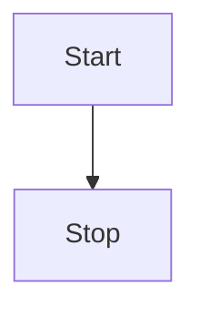

# Tutorial 6: Filters

In this tutorial, you will learn how to apply and compose filters in a network expansion context.

First, create an engine and network with some reactants and initial reagents, saving the network to a file in order to run multiple experiments from the same initial state.

```python
import pickaxe_generic as pg

engine = pg.create_engine()

network = engine.new_network()

reagents = [
    "[H][H]",  # hydrogen
    "O",  # water
    "CO",  # methanol
    "CCO",  # ethanol
    "CC(O)=O",  # acetic acid
]

operator_smarts = {
    "ester_hydrolysis_nonring": "[O&+0:1]=[C&+0:2]-&!@[O&+0&H0:3].[O&+0&H2:4]>>[*:1]=[*:2]-[*:4].[*:3]",
    "ester_hydrolysis_ring": "[O&+0:1]=[C&+0:2]-&@[O&+0&H0:3].[O&+0&H2:4]>>([*:1]=[*:2]-[*:4].[*:3])",
    "esterification": "[O&+0:1]=[C&+0:2]-[O&+0&H1:3].[O&+0&H1:4]>>[*:1]=[*:2]-[*:4].[*:3]",
    "esterification_intra": "([O&+0:1]=[C&+0:2]-[O&+0&H1:3].[O&+0&H1:4])>>[*:1]=[*:2]-[*:4].[*:3]",
    "hydrogenation of carbonyl": "[C+0:1]=[O+0:2].[H][H]>>[*:1][*:2]",
}

for smiles in reagents:
    network.add_mol(engine.mol.rdkit(smiles))

for name, smarts in operator_smarts.items():
    network.add_op(engine.op.rdkit(smarts), meta={"name": name})

network.save_to_file("6-filters")
```

## Basic Network Expansion Grows Quickly

Next, let's run one iteration of the Cartesian strategy to see the resulting system.

```python
from pprint import pprint

network = engine.network_from_file("6-filters")

strat = engine.strat.cartesian(network)

strat.expand(num_iter=1)
```

```sh
>>> pprint(list(enumerate(network.mols)))
[(0, MolDatBasic('[H][H]')),
 (1, MolDatBasic('O')),
 (2, MolDatBasic('CO')),
 (3, MolDatBasic('CCO')),
 (4, MolDatBasic('CC(=O)O')),
 (5, MolDatBasic('CC(O)O')),
 (6, MolDatBasic('COC(C)=O')),
 (7, MolDatBasic('CCOC(C)=O')),
 (8, MolDatBasic('CC(=O)OC(C)=O'))]
>>> pprint([(rxn, network.ops.meta(rxn.operator,["name"])["name"]) for rxn in network.rxns])
[(Reaction(operator=4, reactants=(4, 0), products=(5,)),
  'hydrogenation of carbonyl'),
 (Reaction(operator=2, reactants=(4, 2), products=(6, 1)), 'esterification'),
 (Reaction(operator=2, reactants=(4, 3), products=(7, 1)), 'esterification'),
 (Reaction(operator=2, reactants=(4, 4), products=(8, 1)), 'esterification')]
```

So far, so good.  The acetic acid is the only one with double bonded O, so it is present in all four reactions: one hydrogenation and three esterifications, one of which is a self-esterification to form acetic anhydride (this is not typically performed in a single step, but is a valid relation and of some interest in terms of atom economy).

Now let's try two iterations.

```python
network = engine.network_from_file("6-filters")

strat = engine.strat.cartesian(network)

strat.expand(num_iter=2)
```
```sh
>>> pprint(list(enumerate(network.mols)))
[(0, MolDatBasic('[H][H]')),
 (1, MolDatBasic('O')),
 (2, MolDatBasic('CO')),
 (3, MolDatBasic('CCO')),
 (4, MolDatBasic('CC(=O)O')),
 (5, MolDatBasic('CC(O)O')),
 (6, MolDatBasic('COC(C)=O')),
 (7, MolDatBasic('CCOC(C)=O')),
 (8, MolDatBasic('CC(=O)OC(C)=O')),
 (9, MolDatBasic('CC(=O)OC(C)O')),
 (10, MolDatBasic('COC(C)O')),
 (11, MolDatBasic('CCOC(C)O'))]
>>> pprint([(rxn, network.ops.meta(rxn.operator,["name"])["name"]) for rxn in network.rxns])
[(Reaction(operator=4, reactants=(4, 0), products=(5,)),
  'hydrogenation of carbonyl'),
 (Reaction(operator=2, reactants=(4, 2), products=(6, 1)), 'esterification'),
 (Reaction(operator=2, reactants=(4, 3), products=(7, 1)), 'esterification'),
 (Reaction(operator=2, reactants=(4, 4), products=(8, 1)), 'esterification'),
 (Reaction(operator=2, reactants=(4, 5), products=(9, 1)), 'esterification'),
 (Reaction(operator=4, reactants=(6, 0), products=(10,)),
  'hydrogenation of carbonyl'),
 (Reaction(operator=0, reactants=(6, 1), products=(4, 2)),
  'ester_hydrolysis_nonring'),
 (Reaction(operator=4, reactants=(7, 0), products=(11,)),
  'hydrogenation of carbonyl'),
 (Reaction(operator=0, reactants=(7, 1), products=(4, 3)),
  'ester_hydrolysis_nonring'),
 (Reaction(operator=4, reactants=(8, 0), products=(9,)),
  'hydrogenation of carbonyl'),
 (Reaction(operator=0, reactants=(8, 1), products=(4, 4)),
  'ester_hydrolysis_nonring')]
```

The reactions keep getting larger and more numerous.  Listed below are the molecules after ten generations.

```python
network = engine.network_from_file("6-filters")

strat = engine.strat.cartesian(network)

strat.expand(num_iter=10)
```
```sh
>>> pprint(list(enumerate(network.mols)))
[(0, MolDatBasic('[H][H]')),
 (1, MolDatBasic('O')),
 (2, MolDatBasic('CO')),
 (3, MolDatBasic('CCO')),
 (4, MolDatBasic('CC(=O)O')),
 (5, MolDatBasic('CC(O)O')),
 (6, MolDatBasic('COC(C)=O')),
 (7, MolDatBasic('CCOC(C)=O')),
 (8, MolDatBasic('CC(=O)OC(C)=O')),
 (9, MolDatBasic('CC(=O)OC(C)O')),
 (10, MolDatBasic('COC(C)O')),
 (11, MolDatBasic('CCOC(C)O')),
 (12, MolDatBasic('CC(O)OC(C)O')),
 (13, MolDatBasic('CC(=O)OC(C)OC(C)=O')),
 (14, MolDatBasic('COC(C)OC(C)=O')),
 (15, MolDatBasic('CCOC(C)OC(C)=O')),
 (16, MolDatBasic('CC(=O)OC(C)OC(C)O')),
 (17, MolDatBasic('COC(C)OC(C)O')),
 (18, MolDatBasic('CCOC(C)OC(C)O')),
 (19, MolDatBasic('CC(O)OC(C)OC(C)O')),
 (20, MolDatBasic('CC(=O)OC(C)OC(C)OC(C)=O')),
 (21, MolDatBasic('COC(C)OC(C)OC(C)=O')),
 (22, MolDatBasic('CCOC(C)OC(C)OC(C)=O')),
 (23, MolDatBasic('CC(=O)OC(C)OC(C)OC(C)O')),
 (24, MolDatBasic('COC(C)OC(C)OC(C)O')),
 (25, MolDatBasic('CCOC(C)OC(C)OC(C)O')),
 (26, MolDatBasic('CC(O)OC(C)OC(C)OC(C)O')),
 (27, MolDatBasic('CC(=O)OC(C)OC(C)OC(C)OC(C)=O')),
 (28, MolDatBasic('COC(C)OC(C)OC(C)OC(C)=O')),
 (29, MolDatBasic('CCOC(C)OC(C)OC(C)OC(C)=O')),
 (30, MolDatBasic('CC(=O)OC(C)OC(C)OC(C)OC(C)O')),
 (31, MolDatBasic('COC(C)OC(C)OC(C)OC(C)O')),
 (32, MolDatBasic('CCOC(C)OC(C)OC(C)OC(C)O')),
 (33, MolDatBasic('CC(O)OC(C)OC(C)OC(C)OC(C)O')),
 (34, MolDatBasic('CC(=O)OC(C)OC(C)OC(C)OC(C)OC(C)=O')),
 (35, MolDatBasic('COC(C)OC(C)OC(C)OC(C)OC(C)=O')),
 (36, MolDatBasic('CCOC(C)OC(C)OC(C)OC(C)OC(C)=O')),
 (37, MolDatBasic('CC(=O)OC(C)OC(C)OC(C)OC(C)OC(C)O')),
 (38, MolDatBasic('COC(C)OC(C)OC(C)OC(C)OC(C)O')),
 (39, MolDatBasic('CCOC(C)OC(C)OC(C)OC(C)OC(C)O'))]
```

The increase in number of molecules is due to a sequence of progressive hydrogenations and esterifications creating a swathe of new molecules with ever-longer chain lengths.

While the increase in number of molecules is somewhat manageable in this system, when there are more molecules and more operators of a particular type, it can end up increasing faster than exponential (specifically, O[C^(m^n)] where C is a constant, m is the average arguments per operator, and n is the number of iterations) overwhelm any computer.  This is called the *combinatorial explosion*.

Now we will go over some ways to mitigate this explosion using filters.

## Using Filters to Mitigate Network Growth

A `filter` is a function which is used to remove Recipes or Reactions from consideration.  There are several different types which are interjected at various points during the expansion.

The types of filters currently available are listed below in order of where they occur in the expansion process:

* ReactionFilter - Determines whether the products of a reaction will be tagged as `reactive`.
* MolFilter - Filters out Recipes which list a particular molecule as a reactant (optional arguments are the operator used and the argument to the operator the molecule is being considered for).
* BundleFilter - Reduces the operator-molecule combinations which can be considered.
* RecipeFilter - Filters out specific combinations of an operator and some reactants.

The diagram below shows how the expansion is typically performed and where these filters occur in the process.


